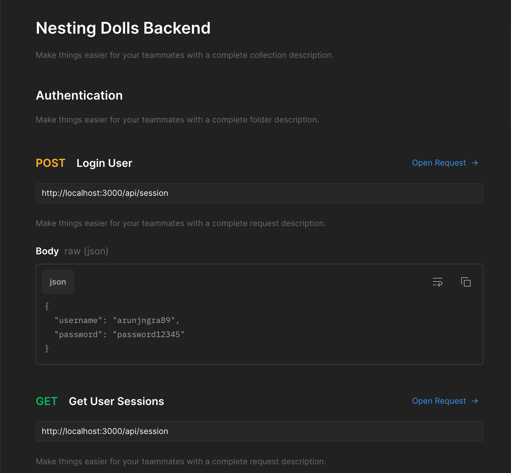
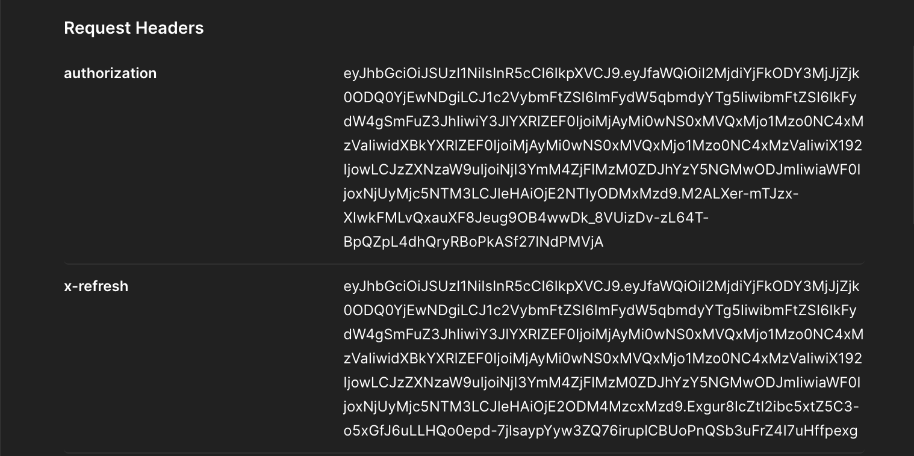
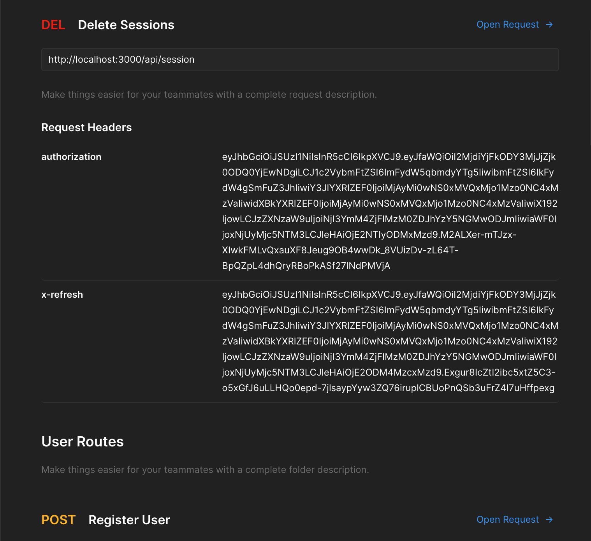
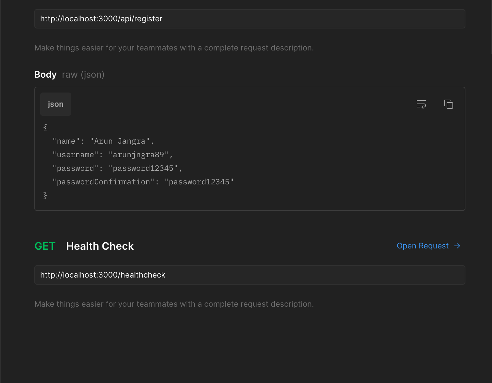

# Nesting Dolls Backend

Here uploading .env temporarily will have to change it afterwards

### Packages Used

Check package.json file

### Package installation

```
# to install all the dependencies
yarn
npm i

# to start the server
yarn start
# ----or----
npm start
```

### Routes (Documentation)

</img>
</img>
</img>
</img>
